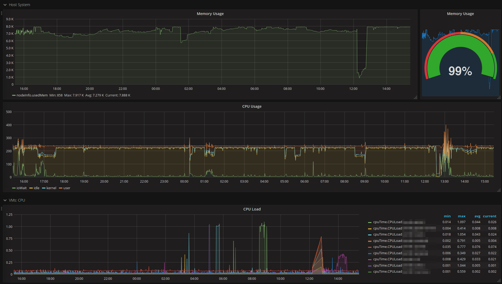

# Python Kafka To InfluxDB Data Importer

This container runs script which relays json data stored in Python InfluxDB compatible format to InfluxDB.

## Why

InfluxDb doesn't have open source option for clustered environment, but Kafka has. So, instead of direct placement of points into InfluxDb it's possible to place them into Kafka, and later relay into standalone InfluxDB databases, which are not clustereed but duplicate each other. Next, the load and failover can be managed with Nginx. 

## Grafana dashboard

* import [grafana_dashboard.json](grafana_dashboard/grafana_dashboard.json) into your grafana
* adjust data source

## License

Licensed under Apache 2.0 license.
